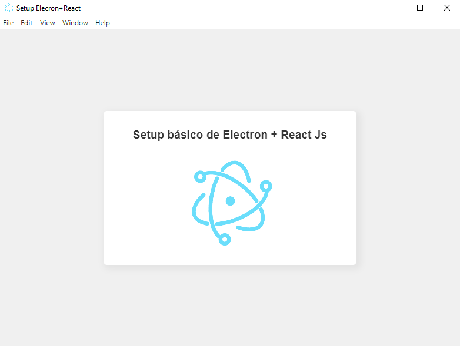

# React com Electron Js :star2:

Um setup extremamente básico para rodar sua aplicação web construída com ReactJS em plataformas desktop (Windows, Linux e Mac)



## Instalação :wrench:

```bash
1. git clone https://github.com/brunopozzebon/setup-electron-react
2. cd ./setup-electron-react
3. yarn 

```

## Comandos :zap:
Para iniciar a aplicação:
```
    yarn start
```

Para fazer o build da aplicação:
```
    yarn build
```
Após gerar o build, o electron gera um executável ou um instalador na pasta **./dist**.

## Customizações básicas 🚀
* Troque o **favicon**, substituindo a imagem _public/icon.png_.
* A estrutura básica de rotas está definida em _src/routes/routes.jsx_, e embutida no arquivo **index.jsx**, não altere o HashRouter pelo BrowserRouter, pois este, apresenta problemas no build do electron.
